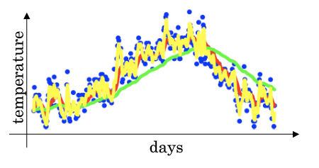

# 改善深度神经网络

## 数据划分

- 训练集（training set）：用训练集对算法或模型进行**训练**过程；
- 验证集（validation set）：利用验证集进行**交叉验证**，**选择最好的模型**；
- 测试集（test set）：最后利用测试集对模型进行测试，**获取模型运行的无偏估计**（对学习方法进行评估）。

在**小数据量**的时代，如 100、1000、10000 的数据量大小，可以将数据集按照以下比例进行划分：

- 无验证集的情况：70% / 30%；
- 有验证集的情况：60% / 20% / 20%；

在如今的**大数据时代**，我们拥有的数据集的规模可能是百万级别的，所以验证集和测试集所占的比重会趋向于变得更小。测试集的主要目的是评估模型的效果，如在单个分类器中，往往在百万级别的数据中，选择其中 1000 条数据足以评估单个模型的效果。

- 100 万数据量：98% / 1% / 1%；
- 超百万数据量：99.5% / 0.25% / 0.25%（或者99.5% / 0.4% / 0.1%）

## 模型估计（偏差/方差）

### 偏差-方差分解

泛化误差可分解为偏差、方差与噪声之和：

- **偏差**：度量了学习算法的期望预测与真实结果的偏离程度，即刻画了**学习算法本身的拟合能力**；
- **方差**：度量了同样大小的训练集的变动所导致的学习性能的变化，即刻画了**数据扰动所造成的影响**；
- **噪声**：表达了在当前任务上任何学习算法所能够达到的期望泛化误差的下界，即刻画了**学习问题本身的难度**。

**偏差-方差分解**说明，**泛化性能**是由**学习算法的能力**、**数据的充分性**以及**学习任务本身的难度**所共同决定的。给定学习任务，为了取得好的泛化性能，则需要使偏差较小，即能够充分拟合数据，并且使方差较小，即使得数据扰动产生的影响小。

### 偏差/方差估计

在**欠拟合**（underfitting）的情况下，出现**高偏差**（high bias）的情况，即不能很好地对数据进行分类。

当模型设置的太复杂时，训练集中的噪声没有被排除，使得模型出现**过拟合**（overfitting）的情况，在验证集上出现**高方差**（high variance）的现象。

- 训练集的错误率较小，而验证集的错误率却较大，说明模型存在较大方差，可能出现了过拟合；
- 训练集和开发集的错误率都较大，且两者相当，说明模型存在较大偏差，可能出现了欠拟合；
- 训练集错误率较大，且开发集的错误率相比训练集较大，说明方差和偏差都较大，模型很差；
- 训练集和开发集的错误率都较小，且两者的相差也较小，说明方差和偏差都较小，这个模型效果比较好。

### 应对方法

存在高偏差：

- 扩大网络规模，如添加隐藏层或隐藏单元数目；
- 寻找合适的网络架构，使用更大的 NN 结构；
- 花费更长时间训练。

存在高方差：

- 获取更多的数据；
- 正则化（regularization）；
- 寻找更合适的网络结构。

## 正则化

**正则化**是在成本函数中加入一个正则化项，惩罚模型的复杂度。正则化可以用于**解决高方差**的问题。

### logistic回归中的正则化

- L2 正则化：
  
  $$
  \frac{\lambda}{2 m}\|w\|_{2}^{2}=\frac{\lambda}{2 m} \sum_{j=1}^{n_{x}} w_{j}^{2}=\frac{\lambda}{2 m} w^{T} w
  $$

- L1 正则化：
  
  $$
  \frac{\lambda}{2 m}\|w\|_{1}=\frac{\lambda}{2 m} \sum_{j=1}^{n_{X}}\left|w_{j}\right|
  $$

其中，λ 为**正则化因子**，是**超参数**。由于 L1 正则化最后得到 w 向量中将存在大量的 0，使模型变得稀疏化，因此 L2 正则化更加常用。

### 神经网络中的正则化

$$
J\left(w^{[1]}, b^{[1]}, \ldots, w^{[L]}, b^{[L]}\right)=\frac{1}{m} \sum_{i=1}^{m} L\left(\hat{y}^{(i)}, y^{(i)}\right)+\frac{\lambda}{2 m} \sum_{l=1}^{L}\left\|w^{[l]}\right\|_{F}^{2}
$$

该矩阵范数被称为**弗罗贝尼乌斯范数（Frobenius Norm）**：

$$
\left\|w^{[l]}\right\|_{F}^{2}=\sum_{i=1}^{n^[l-1]} \sum_{j=1}^{n^[l]}\left(w_{i j}^{[l]}\right)^{2}
$$

### 权重衰减

$$
\begin{gathered}
W^{[l]}:=W^{[l]}-\alpha\left[\frac{\partial L}{\partial w^{[l]}}+\frac{\lambda}{m} W^{[l]}\right] \\
=W^{[l]}-\alpha \frac{\lambda}{m} W^{[l]}-\alpha \frac{\partial L}{\partial w^{[l]}} \\
\quad=\left(1-\frac{\alpha \lambda}{m}\right) W^{[l]}-\alpha \frac{\partial L}{\partial w^{[l]}}
\end{gathered}
$$

上式会给原来的 $W^{[l]}$一个衰减的参数，因此 **L2 正则化项**也被称为**权重衰减（Weight Decay）**。

### 正则化可以减小过拟合的原因

#### 直观解释

正则化因子设置的足够大的情况下，为了使成本函数最小化，权重矩阵 W 就会被设置为接近于 0 的值，**直观上**相当于**消除了很多神经元的影响**，大的神经网络就会变成一个较小的网络。当然，实际上隐藏层的神经元依然存在，但是其影响减弱了，便不会导致过拟合。

#### 数学解释

假设神经元中使用的激活函数为`g(z) = tanh(z)`（`sigmoid` 同理）。加入正则化项后，当 λ 增大，导致 $W^{[l]}$ 减小，$Z^{[l]}=W^{[l]}a^{[l-1]}+b^{[l]}$ 减小。在 $z$ 较小（接近于 0）的区域里，`tanh(z)`函数**近似线性**，所以每层的函数就近似线性函数，整个网络就成为一个简单的近似线性的网络，因此不会发生过拟合。

#### 其他解释

在权值 $w^{[L]}$ 变小之下，输入样本 X 随机的变化不会对神经网络模造成过大的影响，**神经网络受局部噪音的影响的可能性变小**。这就是正则化能够降低模型方差的原因。

## 随机失活dropout

**dropout**（随机失活）是在神经网络的隐藏层为每个神经元结点设置一个随机消除的概率，保留下来的神经元形成一个结点较少、规模较小的网络用于训练。dropout 正则化较多地被使用在计算机视觉（Computer Vision）领域。

### 反向随机失活

反向随机失活是实现 dropout 的方法。对第`l`层进行 dropout：

```python
keep_prob = 0.8    # 设置神经元保留概率
dl = np.random.rand(al.shape[0], al.shape[1]) < keep_prob
al = np.multiply(al, dl)
al /= keep_prob
```

最后一步`al /= keep_prob`是因为 $a^{[l]}$中的一部分元素失活（相当于被归零），为了在下一层计算时不影响 $Z^{[l+1]}=W^{[l+1]} a^{[l]}+b^{[l+1]}$的期望值，因此除以一个`keep_prob`。

**注意**，在**测试阶段不要使用 dropout**，因为那样会使得预测结果变得随机。

### 理解dropout

对于单个神经元，其工作是接收输入并产生一些有意义的输出。但是加入了 dropout 后，输入的特征都存在被随机清除的可能，所以**该神经元不会再特别依赖于任何一个输入特征**，即不会给任何一个输入特征设置太大的权重。因此，通过传播过程，dropout 将产生和 L2 正则化相同的**收缩权重**的效果。

对于不同的层，设置的`keep_prob`也不同。一般来说，神经元较少的层，会设`keep_prob`为 1.0，而神经元多的层则会设置比较小的`keep_prob`。

dropout 的**一大缺点**是成本函数无法被明确定义。因为每次迭代都会随机消除一些神经元结点的影响，因此无法确保成本函数单调递减。因此，使用 dropout 时，先将`keep_prob`全部设置为 1.0 后运行代码，确保 `J(w,b)` 函数单调递减，再打开 dropout。

## 其他正则化方法

- **数据扩增（Data Augmentation）**：通过图片的一些变换（翻转，切割等），得到更多的训练集和验证集。
- **早停止法（Early Stopping）**：将训练集和验证集进行梯度下降时的成本变化曲线画在同一个坐标轴内，当训练集误差降低但验证集误差升高，两者开始发生较大偏差时及时停止迭代，并返回具有最小验证集误差的连接权和阈值，以避免过拟合。这种方法的**缺点是无法同时达成偏差和方差的最优**。

## 标准化输入

使用标准化处理输入 X 能够有效加速收敛。

$$
\begin{gathered}
x=\frac{x-\mu}{\sigma} \\
\mu=\frac{1}{m} \sum_{i=1}^{m} x^{(i)} \\
\sigma=\sqrt{\frac{1}{m} \sum_{i=1}^{m} x^{(i)^{2}}}
\end{gathered}
$$

### 使用标准化的原因

使用标准化前后，成本函数的形状有较大差别。在不使用标准化的成本函数中，如果设置一个较小的学习率，可能需要很多次迭代才能到达全局最优解；而如果使用了标准化，那么无论从哪个位置开始迭代，都能以相对较少的迭代次数找到全局最优解。

## 梯度消失与梯度爆炸

在梯度函数上出现的以指数级递增或者递减的情况分别称为**梯度爆炸**或者**梯度消失**。

假定 $g(z)=z, b^{[l]}=0$，对于目标输出有：

$$
\hat{y}=W^{[L]} W^{[L-1]} \ldots W^{[2]} W^{[1]} X
$$

- 对于  $W^{[l]}$ 的值大于 1 的情况，激活函数的值将以指数级递增；
- 对于  $W^{[l]}$ 的值小于 1 的情况，激活函数的值将以指数级递减。

对于导数同理。因此，在计算梯度时，根据不同情况梯度函数会以指数级递增或递减，导致训练导数难度上升，梯度下降算法的步长会变得非常小，需要训练的时间将会非常长。

### 利用初始化缓解梯度消失和爆炸

根据

$$
z=w_{1} x_{1}+w_{2} x_{2}+\ldots+w_{n} x_{n}+b
$$

可知，当输入的数量 n 较大时，我们希望每个 $w_i$ 的值都小一些，这样它们的和得到的 z 也较小。为了得到较小的 $w_i$，设置`Var(wi)=1/n`，这里称为 **Xavier initialization**。

```py
WL = np.random.randn(WL.shape[0], WL.shape[1]) * np.sqrt(1/n)
```

其中 n 是输入的神经元个数，即`WL.shape[1]`。这样，激活函数的输入 x 近似设置成均值为 0，标准方差为 1，神经元输出 z 的方差就正则化到 1 了。虽然没有解决梯度消失和爆炸的问题，但其在一定程度上确实**减缓**了梯度消失和爆炸的速度。

同理，也有 **He Initialization**。它和 Xavier initialization 唯一的区别是`Var(wi)=2/n`，适用于 **ReLU** 作为激活函数时。

总结：当激活函数使用 **ReLU** 时，`Var(wi)=2/n`；当激活函数使用 **tanh** 时，`Var(wi)=1/n`。

## 优化算法

### batch梯度下降

**batch 梯度下降法**（批梯度下降法）是最常用的梯度下降形式，即同时处理整个训练集。其在更新参数时使用所有的样本来进行更新。

对整个训练集进行梯度下降法的时候，我们必须处理整个训练数据集，然后才能进行一步梯度下降，即每一步梯度下降法需要对整个训练集进行一次处理，如果训练数据集很大的时候，处理速度就会比较慢。

但是如果每次处理训练数据的一部分即进行梯度下降法，则我们的算法速度会执行的更快。而处理的这些一小部分训练子集即称为 **mini-batch**。

### mini-batch梯度下降

**Mini-Batch 梯度下降法**（小批量梯度下降法）每次同时处理单个的 mini-batch，其他与 batch 梯度下降法一致。

使用 batch 梯度下降法，对整个训练集的一次遍历只能做一个梯度下降；而使用 Mini-Batch 梯度下降法，对整个训练集的一次遍历（称为一个 epoch）能做 mini-batch 个数个梯度下降。之后，可以一直遍历训练集，直到最后收敛到一个合适的精度。

batch 梯度下降法和 Mini-batch 梯度下降法代价函数的变化趋势如下：


- batch 梯度下降法：
  - 对所有 m 个训练样本执行一次梯度下降，**每一次迭代时间较长，训练过程慢**；
  - 相对噪声低一些，幅度也大一些；
  - 成本函数总是向减小的方向下降。
- 随机梯度下降法：
  - 对每一个训练样本执行梯度下降，训练速度快，但**丢失了向量化带来的计算加速**；
  - 有很多噪声，减小学习率可以适当；
  - 成本函数总体趋势向全局最小靠近，但不会收敛，而是一直在最小值附近波动。

因此，选择一个`1 < size < m`的合适的大小进行 Mini-batch 梯度下降，可以实现快速学习，也应用了向量化带来的好处，且成本函数的下降处于前两者之间。

- 如果训练样本的大小比较小，如 m ⩽ 2000 时，选择 batch 梯度下降法；
- 如果训练样本的大小比较大，选择 Mini-Batch 梯度下降法。为了和计算机的信息存储方式相适应，代码在 mini-batch 大小为 2 的幂次时运行要快一些。典型的大小为 $2^6, 2^7, 2^8, 2^9$；
- mini-batch 的大小要符合 CPU/GPU 内存。

mini-batch 的大小也是一个重要的超变量，需要根据经验快速尝试，找到能够最有效地减少成本函数的值。

### 指数平均加权

**指数加权平均**（Exponentially Weight Average）是一种常用的序列数据处理方式，计算公式为：

$$
S_{t}= \begin{cases}Y_{1}, & t=1 \\ \beta S_{t-1}+(1-\beta) Y_{t}, & t>1\end{cases}
$$



给定一个时间序列，例如伦敦一年每天的气温值，图中蓝色的点代表真实数据。对于一个即时的气温值，取权重值 β 为 0.9，根据求得的值可以得到图中的红色曲线，它反映了气温变化的大致趋势。取权重值 β=0.98 时，可以得到图中更为平滑的绿色曲线。而当取权重值 β=0.5 时，得到图中噪点更多的黄色曲线。**β 越大相当于求取平均利用的天数越多**，曲线自然就会越平滑而且越滞后。

### 动量梯度下降

**动量梯度下降**（Gradient Descent with Momentum）是计算梯度的指数加权平均数，并利用该值来更新参数值。

$$
\begin{gathered}
v_{d W}^{[l]}=\beta v_{d W}^{[l]}+(1-\beta) d W^{[l]} \\
v_{d b}[l]=\beta v_{d b}[l]+(1-\beta) d b^{[l]} \\
W^{[l]}:=W^{[l]}-\alpha v_{d W}^{[l]} \\
b^{[l]}:=b^{[l]}-\alpha v_{d b}[l]
\end{gathered}
$$

将**动量衰减参数 β 设置为 0.9** 是超参数的一个常见且效果不错的选择。当 β 被设置为 0 时，显然就成了 batch 梯度下降法。


进行一般的梯度下降将会得到图中的蓝色曲线，由于存在上下波动，减缓了梯度下降的速度，因此只能使用一个较小的学习率进行迭代。如果用较大的学习率，结果可能会像紫色曲线一样偏离函数的范围。

而使用动量梯度下降时，通过累加过去的梯度值来减少抵达最小值路径上的波动，加速了收敛，因此在横轴方向下降得更快，从而得到图中红色的曲线。

**当前后梯度方向一致时，动量梯度下降能够加速学习；而前后梯度方向不一致时，动量梯度下降能够抑制震荡。**

### RMSProp优化算法

**RMSProp**（Root Mean Square Propagation，均方根传播）算法是在对梯度进行指数加权平均的基础上，引入平方和平方根。

$$
\begin{gathered}
s_{d w}=\beta s_{d w}+(1-\beta)(d w)^{2} \\
s_{d b}=\beta s_{d b}+(1-\beta)(d b)^{2} \\
w:=w-\alpha \frac{d w}{\sqrt{s_{d w}+\epsilon}} \\
b:=b-\alpha \frac{d b}{\sqrt{s_{d b}+\epsilon}}
\end{gathered}
$$

其中，ϵ 是一个实际操作时加上的较小数（例如10^-8），为了防止分母太小而导致的数值不稳定。

RMSProp 有助于减少抵达最小值路径上的摆动，并允许使用一个更大的学习率 α，从而加快算法学习速度。并且，它和 Adam 优化算法已被证明适用于不同的深度学习网络结构。

### Adam优化算法

**Adam** 优化算法（Adaptive Moment Estimation，自适应矩估计）基本上将 Momentum 和 RMSProp 算法结合在一起，通常有超越二者单独时的效果。

Adam 优化算法有很多的超参数，其中

- 学习率 α：需要尝试一系列的值，来寻找比较合适的；
- β1：常用的缺省值为 $0.9$；
- β2：Adam 算法的作者建议为 $0.999$；
- ϵ：不会影响算法表现，Adam 算法的作者建议为 $10^{-8}$；

β1、β2、ϵ 通常不需要调试。

## 学习率衰减

如果设置一个固定的学习率 α，在最小值点附近，由于不同的 batch 中存在一定的噪声，因此不会精确收敛，而是始终在最小值周围一个较大的范围内波动。而如果随着时间慢慢减少学习率 α 的大小，在初期 α 较大时，下降的步长较大，能以较快的速度进行梯度下降；而后期逐步减小 α 的值，即减小步长，有助于算法的收敛，更容易接近最优解。

## 局部最优问题

**鞍点**（saddle）是函数上的导数为零，但不是轴上局部极值的点。当我们建立一个神经网络时，通常梯度为零的点是上图所示的鞍点，而非局部最小值。减少损失的难度也来自误差曲面中的鞍点，而不是局部最低点。

- 在训练较大的神经网络、存在大量参数，并且成本函数被定义在较高的维度空间时，困在极差的局部最优中是不大可能的；
- 鞍点附近的平稳段会使得学习非常缓慢，而这也是动量梯度下降法、RMSProp 以及 Adam 优化算法能够加速学习的原因，它们能帮助尽早走出平稳段。

## 超参数调试

### 超参数重要程度

- **最重要**：
  - 学习率 α；
- **其次重要**：
  - β：动量衰减参数，常设置为 0.9；
  - \# hidden units：各隐藏层神经元个数；
  - mini-batch 的大小；
- **再次重要**：
  - β1，β2，ϵ：Adam 优化算法的超参数，常设为 0.9、0.999、10−810−8；
  - \# layers：神经网络层数;
  - decay_rate：学习衰减率；

### 选择合适的范围

- 对于学习率 α，用**对数标尺**而非线性轴更加合理：0.0001、0.001、0.01、0.1 等，然后在这些刻度之间再随机均匀取值；
- 对于 β，取 0.9 就相当于在 10 个值中计算平均值，而取 0.999 就相当于在 1000 个值中计算平均值。可以考虑给 1-β 取值，这样就和取学习率类似了。

上述操作的原因是当 β 接近 1 时，即使 β 只有微小的改变，所得结果的灵敏度会有较大的变化。例如，β 从 0.9 增加到 0.9005 对结果（1/(1-β)）几乎没有影响，而 β 从 0.999 到 0.9995 对结果的影响巨大（从 1000 个值中计算平均值变为 2000 个值中计算平均值）。

## 批标准化BN

**批标准化**（Batch Normalization，简称为 BN）会使参数搜索问题变得很容易，使神经网络对超参数的选择更加稳定，超参数的范围会更庞大，工作效果也很好，也会使训练更容易。

之前，我们对输入特征 X 使用了标准化处理。我们也可以用同样的思路处理**隐藏层**的激活值 $a^{[l]}$，以加速 $W^{[l+1]}$ 和 $b^{[l+1]}$ 的训练。在**实践**中，经常选择标准化 $Z^{[l]}$。

$$
\begin{gathered}
\mu=\frac{1}{m} \sum_{i} z^{(i)} \\
\sigma^{2}=\frac{1}{m} \sum_{i}\left(z_{i}-\mu\right)^{2} \\
z_{\text {norm }}^{(i)}=\frac{z^{(i)}-\mu}{\sqrt{\sigma^{2}+\epsilon}}
\end{gathered}
$$

其中 m 是单个 mini-batch 所包含的样本个数，ϵ 是为了防止分母为零，通常取 $10^{-8}$。这样，我们使得所有的输入均值为 0，方差为 1。但我们不想让隐藏层单元总是含有平均值 0 和方差 1，也许隐藏层单元有了不同的分布会更有意义。因此，我们计算：

$$
\tilde{z}^{(i)}=\gamma z_{\text {norm }}^{(i)}+\beta
$$

其中，γ 和 β 都是模型的学习参数，所以可以用各种梯度下降算法来更新 γ 和 β 的值，如同更新神经网络的权重一样。

**设置 γ 和 β 的原因**是，如果各隐藏层的输入均值在靠近 0 的区域，即处于激活函数的线性区域，不利于训练非线性神经网络，从而得到效果较差的模型。因此，需要用 γ 和 β 对标准化后的结果做进一步处理。

对于 L 层神经网络，经过 Batch Normalization 的作用，整体流程如下：


### BN有效的原因

Batch Normalization 效果很好的原因有以下两点：

1. 通过对隐藏层各神经元的输入做类似的标准化处理，**提高神经网络训练速度**；
2. 可以使前面层的权重变化对后面层造成的影响减小，**整体网络更加健壮**。

即使输入的值改变了，由于 Batch Normalization 的作用，使得均值和方差保持不变（由 γ 和 β 决定），限制了在前层的参数更新对数值分布的影响程度，因此后层的学习变得更容易一些。**BN 减少了各层 W 和 b 之间的耦合性，让各层更加独立，实现自我训练学习的效果。**

另外，Batch Normalization 也**起到微弱的正则化**（regularization）效果。因为在每个 mini-batch 而非整个数据集上计算均值和方差，只由这一小部分数据估计得出的均值和方差会有一些噪声，因此最终计算出的 $z̃ (i)$ 也有一定噪声。类似于 dropout，这种噪声会使得神经元不会再特别依赖于任何一个输入特征。由于 BN 只有微弱的正则化效果，因此可以和 dropout 一起使用，以获得更强大的正则化效果。通过应用更大的 mini-batch 大小，可以减少噪声，从而减少这种正则化效果。

最后，**不要将 Batch Normalization 作为正则化的手段，而是当作加速学习的方式**，**Batch Normalization 解决的还是反向传播过程中的梯度问题**（梯度消失和爆炸）。

### 测试时的BN

Batch Normalization 将数据以 mini-batch 的形式逐一处理，但在测试时，可能需要对每一个样本逐一处理，这样无法得到 $\mu$ 和 $\sigma^2$。

理论上，我们可以将所有训练集放入最终的神经网络模型中，然后将每个隐藏层计算得到的 $\mu^{[l]}$ 和 $\sigma^{2[l]}$ 直接作为测试过程的 $\mu$ 和 $\sigma^2$ 来使用。但是，实际应用中一般不使用这种方法，而是使用之前学习过的指数加权平均的方法来预测测试过程单个样本的  $\mu$  和 $\sigma^2$。

对于第 $l$ 层隐藏层，考虑所有 mini-batch 在该隐藏层下的 $\mu^{[l]}$ 和 $\sigma^{2[l]}$，然后用指数加权平均的方式来预测得到当前单个样本的 $\mu^{[l]}$ 和 $\sigma^{2[l]}$。这样就实现了对测试过程单个样本的均值和方差估计。

## Softmax回归

对于 Softmax 回归模型的输出层，即第 L 层，有（logit可以为任意数，可以小于0）：

$$
Z^{[L]}=W^{[L]} a^{[L-1]}+b^{[L]}
$$

输出层每个神经元的输出，对应属于该类的概率：

$$
a_{i}^{[L]}=\frac{e^{Z_{i}^{[L]}}}{\sum_{i=1}^{C} e^{Z_{l}^{[L]}}}
$$

**损失函数**：

$$
L(\hat{y}, y)=-\sum_{j=1}^{C} y_{j} \log \hat{y}_{j}
$$

当 i 为样本真实类别时，损失函数可以简化为：

$$
L(\hat{y}, y)=-y_{i} \log \hat{y}_{i}=\log \hat{y}_{i}
$$

**注：Pytorch 中的 CrossEntropyLoss 是将输出先做 softmax 再 log 似然损失（NLL）。**
